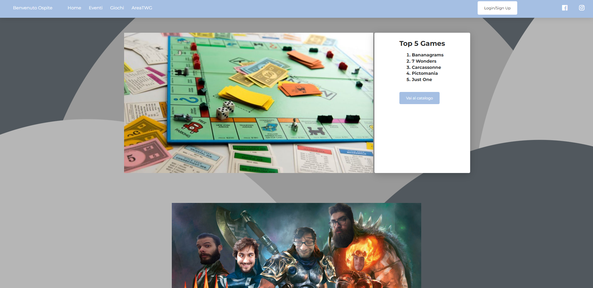
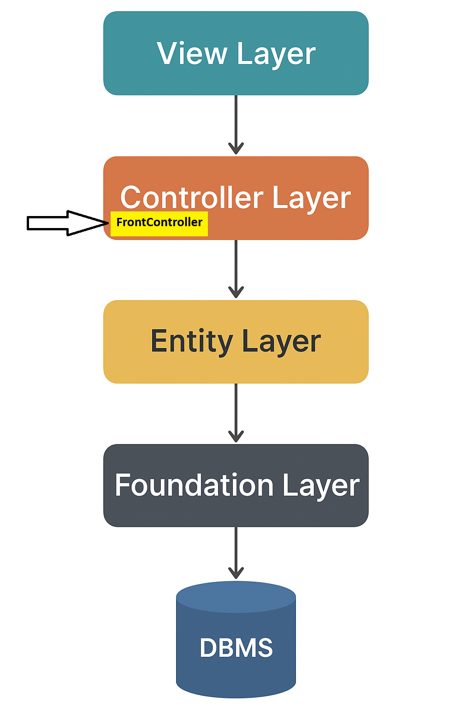

# 🎲 PlayadiceWeb

## Project Overview
<p align="center">

</p>

**PlayadiceWeb** is a web-based management system designed for the needs of the association [Playadice](https://www.instagram.com/playadiceofficial?igsh=MW9xcjhleWpqc3Nibw==), of which I am a board member.

**Playadice** is a board game and role-playing game association that promotes social inclusion and the refinement of mental skills through play.

During the first years of activity, we realized the need for a software tool to digitalize some information (e.g., data about associate members, the catalog of games in our collection, and the event calendar). From this idea, **PlayadiceWeb** was born.

⚠️ The documentation and comments on the code are in Italian.

---

## ✨ Main Features
- **Games Management:** Store and catalog board games, including detailed information and the ability for associate members to review them.
- **People Management:** Register, update, and organize members or participants of the association.
- **Events Management:** Schedule and track events, including attendance and participants.

---

## 📚 Technical Details

This project was developed for the **Web Programming Exam** at *Univaq*.  
As requested by the Professor:
- **No framework** was used: every single aspect of the full-stack development was coded from scratch (from the UI to the database).
- The **MVC architectural design pattern** was followed, with an additional `Foundation Layer` responsible for generating queries and communicating with the database.
- The project was built entirely using the **OOP paradigm**.
- We also applied a **software engineering process**, first analyzing the use cases and drafting the initial UI.

---

## 🚀 Getting Started

The app was developed using [XAMPP](https://www.apachefriends.org/it/download.html) version **7.4.3**.  
Please install XAMPP with the following modules:
- Apache Server  
- MySQL  
- PHP  

### Installation Steps

1. Clone the repository into the `xampp/htdocs` folder:
   ```bash
   git clone https://github.com/Puaison/PlayadiceWeb.git
   ```
2. Open **XAMPP Control Panel** and start `Apache` and `MySQL`.
3. In your browser, visit: `localhost/PlayadiceWeb/`. You will see the installation screen.
4. Insert your DBMS credentials (by default: user `root` with no password) and set a name for the database.
These values will be stored in a configuration file called `config.inc.php`.
5. The database will be automatically created using the schemas in CreateTables.txt.
The first generated Moderator account will be:
   ```
   Username: Puaison
   Password: playadice
   ```
6. From now on, visiting `localhost/PlayadiceWeb/` will take you to the homepage of the application.
---
# 🛠 Work Overview  

Developed with **OOP best practices**  

## 👤 My Contributions
- Full design and development of the **Games Management module** (UI, backend, Foundation layer, UML Class Diagram, and MySQL schema).  
- Contribution to the **People Management module**.  

---

## 🧩 Tools & Organization
- **Smarty** templating engine for dynamic rendering.  
- **MVC hierarchy extended as:** `View → Controller → Entity → Foundation`.  
- **Singleton Pattern** applied for unique access points to each layer.  

### ⚙️ FrontController Design
- Incoming requests first hit `index.php`.  
- If the app is already installed, the request is forwarded to the **FrontController**.  
- The **FrontController** delegates execution to the necessary **Controller** classes, which call the **Model** (Entity + Foundation).  
- If a CRUD operation is required, the **Foundation** layer is used.  
- Finally, the **View** layer generates the HTML page and returns it to the **FrontController** that will send it to the user.  

### 🗄 Database Connection
- Managed via [**PDO**](https://www.php.net/manual/en/book.pdo.php) extension.  
- `PersistentManager` (inside the Foundation layer) handles opening/closing connections.  
- Query classes in Foundation provide robust, dynamic templates protected against SQL injection.  

---

## 🎨 MVC + Foundation Architecture
Below is a simplified diagram of the architecture used in **PlayadiceWeb**:

<p align="center">

</p>

---

## 🌟 Features Recap
- Web interface for managing games, members, and events  
- User authentication and role management  
- Search and filtering capabilities (for users and games)  
- Event scheduling and participant tracking  

---

## 📄 Documentation
The full documentation is available in the `documentazione` folder.  
For **PHPDOC**, open the `index.html` file inside that directory. 
